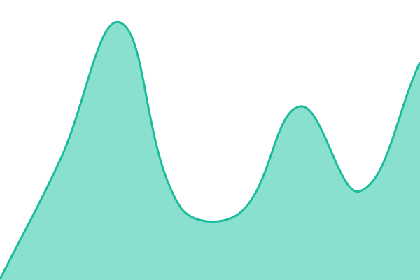

# [📈 Live Status](https://andreruffert.github.io/up): <!--live status--> **🟩 All systems operational**

<!--start: status pages-->
<!-- This summary is generated by Upptime (https://github.com/upptime/upptime) -->
<!-- Do not edit this manually, your changes will be overwritten -->
<!-- prettier-ignore -->
| URL | Status | History | Response Time | Uptime |
| --- | ------ | ------- | ------------- | ------ |
|  [andreruffert.com](https://andreruffert.com) | 🟩 Up | [andreruffert-com.yml](https://github.com/andreruffert/up/commits/HEAD/history/andreruffert-com.yml) | 

 219ms
     
 | 

<a href="https://andreruffert.github.io/up/history/andreruffert-com">98.61%</a>
    

|  [letr.app](https://letr.andreruffert.com) | 🟩 Up | [letr-app.yml](https://github.com/andreruffert/up/commits/HEAD/history/letr-app.yml) | 

 361ms
     
 | 

<a href="https://andreruffert.github.io/up/history/letr-app">98.61%</a>
    

|  [piphero.app](https://piphero.andreruffert.com) | 🟩 Up | [piphero-app.yml](https://github.com/andreruffert/up/commits/HEAD/history/piphero-app.yml) | 

 203ms
     
 | 

<a href="https://andreruffert.github.io/up/history/piphero-app">98.61%</a>
    

<!--end: status pages-->

[**Status page →**](https://andreruffert.github.io/up)
